# Microservice module assessment

## Description
This project aims to progressively build a web application using a microservice architecture inspired by the "Motus" game. The application includes a functioning Motus game, a scoring system, and an authentication system.

## Architecture Overview
The project is divided into the following components:
- **motus_app:** Contains the Motus game application developed using JavaScript and HTML. It provides a daily word to each participant and runs locally on port 3000.
- **score_app:** Houses the scoring system connected to Motus, operating on port 3001.
- **auth:** Manages the authentication system functioning with OAuth2.
- **node_modules:** Directory for storing project dependencies.

## Development Steps
1. **Motus Application Development:**
    - Implemented the Motus game functionality providing daily words to players.
    - Developed using JavaScript and HTML, accessible locally via port 3000.

2. **Scoring System Development:**
    - Created a scoring system integrated with the Motus game.
    - Developed as a separate microservice, accessible via port 3001.

3. **Authentication System Setup:**
    - Established an authentication system using OAuth2.
    - Housed within the 'auth' directory.

## Installation and Execution
To run the project locally, follow these steps:

1. Clone the repository:
    ```bash
    git clone <repository_url>
    ```

2. Navigate to the project directory:
    ```bash
    cd assessment_project
    ```

3. Start the Motus application:
    ```bash
    cd motus_app
    npm install
    npm install cross-fetch
    node server.js
    ```

4. Start the scoring system:
    ```bash
    cd ../score_app
    npm install
    node score.js
    ```

5. Run the authentication system:
    ```bash
    cd ../auth_app
    npm install
    npm start
    ```

6. Access the Motus game in your browser at [http://localhost:3000](http://localhost:3000).


## Diagrams

```mermaid
sequenceDiagram
    Client-->>Motus server: 1) Request word
    Motus server -->> FileSystem: 1) Find the word in file listes_français_utf8
    FileSystem-->>Motus server: 1) Send the word of the day
 
    Client-->>Motus server: 2) Submit guess
    Motus server-->> Motus server: 2) Handle POST /checkword
    Motus server-->> Motus server: 2) Calcul feedback
    Motus server-->> Client: 2) Send feedback to user
```

 


 Communication between server


## Project Status
Main parts of the project are funstional. Indeed, we are able to launch the motus app and track the score of a user in the game.\
However, the authentification still needs to be improved, as we did not store the credentials with a database (we tried to use *redis* for that purpose, without success). Also, docker is only working for the motus application, but we could not manage to make it work for the score tracking. As an additional note, since we were not able to make a functioning database with redis, we mainly used json files and local variables to store the information we needed to work (score tracking and authentification).


## Next Steps
For future enhancements, we could consider:
- Assuring each Docker configuration for each microserviceis working fine.
- Adding extra functionalities such as a database integration, additional games, or a dedicated frontend server.
- Exploring alternative technologies for specific components, e.g., switching from Node.js to Python Flask for certain services.
- Use a HAproxy service to loadbalance our motus server, by instanciating 2 motus servers, then listening on port 3001. HAproxy would have used the round-robin method to perform load balancing in 50/50 mode between the two servers. \
Command to launch the file *haproxy.cfg*: 
 ```bash
    haproxy -f haproxy.cfg
 ```

## Authors

Farid GNANKAMBARY \
Jean-Baptiste GREFFE \
Anis DAHMANI

## Teacher

Mr.Simon GOMEZ


## Team Effort
This project was a collaborative effort, with each team member contributing to different aspects of development, documentation, and testing.

For any inquiries or assistance, feel free to contact the project team.

---
